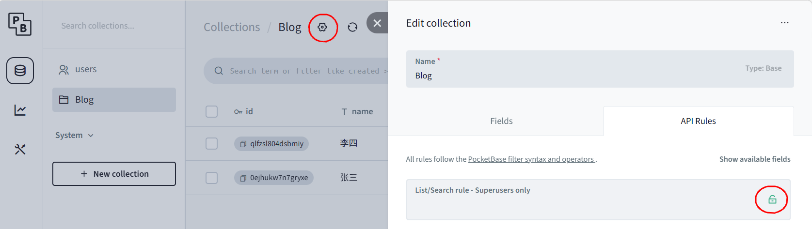

# PocketBase

## 下载安装

下载

[pocketbase/pocketbase: Open Source realtime backend in 1 file](https://github.com/pocketbase/pocketbase)

解压

解压或复制pocketbase到 <span data-type="text" style="background-color: var(--b3-card-error-background); color: var(--b3-card-error-color);">linux</span> 文件夹下

## 创建管理员

未启动服务或未生成数据库，不影响账号创建

```sh
./pocketbase superuser create xhsql@163.com xhsql2026.
```

## 直接启动

​`注意` 尽量使用IP访问，使用localhost时可能会由于部分系统的IP6优先原则，造成不必要的访问延迟

```sh
./pocketbase serve --http=192.168.4.51:8090
```

## 后台启动

```sh
nohup ./pocketbase serve --http=192.168.4.51:8090 > pocketbase.log 2>&1 &
```

## 后台结束

```sh
pkill -f pocketbase
或
killall pocketbase
```

## 后台管理

```sh
http://192.168.4.51:8090/_
```

使用管理员账号密码登录

### 创建用户

user表中，新建用户

管理员账号用于登录后台和管理用户，普通用户用于访问数据。

### 创建表

点击，New collection，创建Blog表-name,age字段

点击，New record，并写入示例数据

### 设置API权限

如图，按需设置API访问权限即可



‍

## 访问API

### PocketBase版

```python
pip install PocketBase
```

```python
from pocketbase import PocketBase
import time

# 1. 连接并登录
client = PocketBase('http://192.168.4.51:8090')
auth = client.collection("users").auth_with_password("sqlite@163.com", "sqlite2026.")
print(f"✅ 登录: {auth.record.email}")

# 2. 查询数据
records = client.collection("Blog").get_full_list()
print(f"📊 共 {len(records)} 条记录")

# 3. 显示结果
for r in records:
    print(f"👤 {getattr(r, 'name', 'N/A')} ({getattr(r, 'age', 'N/A')}岁)")

# 结果示例
# ✅ 登录: sqlite@163.com
# 📊 共 2 条记录
# 👤 张三 (25岁)
# 👤 李四 (16岁)
```

### requests版

```python
pip install requests
```

```python
import requests

r = requests.post("http://192.168.4.51:8090/api/collections/users/auth-with-password", 
                  json={"identity":"sqlite@163.com","password":"sqlite2026."})
token = r.json()['token']

r = requests.get("http://192.168.4.51:8090/api/collections/Blog/records", 
                 headers={"Authorization": token})

for item in r.json()['items']:
    print(f"{item['name']} - {item['age']}岁")

# 返回结果
# 张三 - 25岁
# 李四 - 16岁

```

### 常见问题

返回 `Only superusers can perform this action.`​ 时，即为 `只有超级用户可以执行此操作。` 打开相应API访问权限即可。

### 网址访问

```url
# 获取所有记录
http://192.168.4.51:8090/api/collections/Blog/records

# 按年龄排序
http://192.168.4.51:8090/api/collections/Blog/records?sort=age

# 获取单条记录（替换 RECORD_ID）
http://192.168.4.51:8090/api/collections/Blog/records/RECORD_ID

# 限制返回字段
http://192.168.4.51:8090/api/collections/Blog/records?fields=id,name,age

# 分页
http://192.168.4.51:8090/api/collections/Blog/records?page=1&perPage=10
```

### 权限设置

┌─────────────────────────────────────┐  
│ List Rule	 [ @request.auth.id != '' ] │  ← 列表权限		 │  
├─────────────────────────────────────┤  
│ View Rule	[ @request.auth.id != '' ] │  ← 查看权限		 │  
├─────────────────────────────────────┤  
│ Create Rule	[ @request.auth.id != '' ] │  ← 创建权限		 │  
├─────────────────────────────────────┤  
│ Update Rule	[ @request.auth.id != '' ] │  ← 更新权限		 │  
├─────────────────────────────────────┤  
│ Delete Rule	[ @request.auth.id != '' ] │  ← 删除权限		 │  
└─────────────────────────────────────┘

|API 规则|设置|
| --------------------| ------------|
|**完全公开**（任何人都能访问）|解锁 或 `true`|
|**仅登录用户**|​`@request.auth.id != ''`|
|**完全禁止**|锁定 或 `false`|
|**仅自己**（需要author字段）|​`@request.auth.id = author`|
|**仅管理员**|​`@request.auth.role = 'admin'`|
